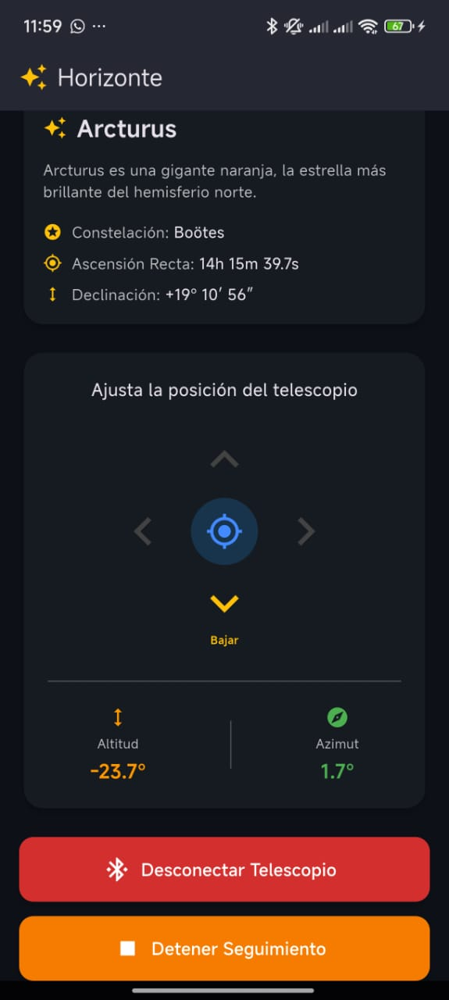
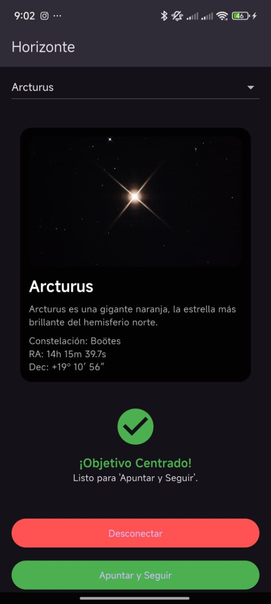

# Horizonte (Telescopio-GoTo)

Sistema de apuntamiento computarizado "GoTo" para telescopios, controlado por la aplicación móvil **Horizonte** a través de Bluetooth Low Energy (BLE) y Wi-Fi (UDP).

Este repositorio contiene todo el software (App y API) y el firmware (C/C++) del proyecto.

## Interfaz de la Aplicación 

La aplicación móvil está desarrollada en Flutter y cuenta con un tema oscuro diseñado específicamente para preservar la visión nocturna del usuario durante las observaciones astronómicas. 

| Ajuste y Calibración | Seguimiento Activo |
| :---: | :---: |
|  |  |
| **Guía de Posicionamiento:** Cuando el telescopio está fuera de rango, la app calcula el delta de error entre las coordenadas actuales (leídas vía BLE/UDP) y el astro seleccionado, mostrando flechas direccionales para guiar al usuario a centrar el objetivo. | **Go-To y Tracking:** Una vez que el telescopio está centrado ("¡Objetivo Centrado!"), el usuario puede iniciar el seguimiento automatizado. La app enviará continuamente las coordenadas compensadas al controlador PID de la Raspberry Pi Pico W. |

## Estado Actual del Proyecto (Marzo 2026)

**Importante:** Este es un proyecto en desarrollo activo.
* **Software (App Móvil):** La aplicación de Flutter está funcional. Se conecta al servidor, muestra los datos astronómicos, calcula las coordenadas horizontales (Azimut/Altitud) en tiempo real mediante el GPS del dispositivo y las transmite por BLE.
* **Software (Servidor):** El backend con Django y la API REST están funcionales, sirviendo los datos de los astros desde una base de datos.
* **Hardware (Controlador):** El firmware ha sido migrado exitosamente a Raspberry Pi Pico W utilizando C/C++ nativo. La lógica de control PID, la lectura de sensores (MPU9250/AK8963) vía I2C y la comunicación concurrente BLE/UDP están implementadas. La integración física con la montura y la calibración final de los motores paso a paso están en curso.

## Estructura del Repositorio

* `/Software/Horizonte/app`: Aplicación móvil "Horizonte" (Flutter/Dart).
* `/Software/Horizonte/server`: Backend y API REST (Django/Python).
* `/Hardware/horizonte-hardware`: Código fuente y configuración del microcontrolador.
    * `/src`: Archivos fuente en C (`main.c`, código autogenerado del perfil GATT).
    * `/include`: Cabeceras (`.h`).
    * `CMakeLists.txt`: Configuración de compilación para el SDK de la Pico.
    * `horizonte.gatt`: Definición del perfil Bluetooth LE personalizado.

## Tecnologías Utilizadas

**Frontend (App Móvil):**
* **Framework:** Flutter (Dart)
* **Comunicación:** `flutter_blue_plus` (BLE), `http` (API)
* **Geolocalización:** `geolocator`

**Backend (Servidor API):**
* **Framework:** Django & Django REST Framework (Python 3.8+)
* **Base de Datos:** MySQL (o SQLite para desarrollo local)

**Hardware (Controlador Go-To):**
* **Plataforma:** Raspberry Pi Pico W (RP2040)
* **Lenguaje:** C/C++ (Pico C/C++ SDK, CMake )
* **Sensores (IMU):** Acelerómetro y Giroscopio MPU9250 + Magnetómetro AK8963 (Comunicación I2C). Filtro Madgwick implementado por software.
* **Comunicaciones:** BLE (Pico BTstack , Servicio primario FFE0 ) y servidor UDP de respaldo vía LwIP.
* **Actuadores:** Motores a Pasos NEMA 17 con drivers (Controlados por GPIO mediante modulación de pulsos y PID).

---

## Guía de Instalación y Puesta en Marcha

### Prerrequisitos Globales
* Git
* **Para el Servidor:** Python 3.8+ y un servidor MySQL.
* **Para la App:** Flutter SDK.
* **Para el Hardware:** CMake (v3.13+), ARM GCC Toolchain (`arm-none-eabi-gcc`), y el **Raspberry Pi Pico SDK** configurado en tu variable de entorno `PICO_SDK_PATH`.


### 1. Configuración del Backend (Servidor)

Estos pasos prepararán el servidor Django.

1.  **Clona el repositorio y navega a la carpeta del servidor:**
    *(Si ya lo clonaste, solo navega a la carpeta)*
    ```bash
    git clone <URL_DE_TU_REPOSITORIO>
    cd Telescopio-Goto/Software/Horizonte/server
    ```

2.  **Crea y activa el entorno virtual:**
    ```bash
    # Crear el entorno virtual
    python -m venv venv

    # Activar el entorno (en Windows)
    .\venv\Scripts\activate
    ```

3.  **Instala todas las dependencias de Python necesarias:**
    ```bash
    pip install django djangorestframework django-cors-headers mysqlclient
    ```

4.  **Configura tus credenciales locales:**
    * Dentro de la carpeta `.../server/backend/`, crea un nuevo archivo llamado `local_settings.py`.
    * Añade tus credenciales secretas en este archivo.

    ```python
    # Ejemplo de contenido para local_settings.py
    SECRET_KEY = 'tu_clave_secreta_personal_aqui'

    DB_NAME = 'stardata'
    DB_USER = 'tu_usuario_de_mysql'
    DB_PASSWORD = 'tu_contraseña_de_mysql'
    ```

5.  **Crea las tablas en tu base de datos MySQL:**
    ```bash
    python manage.py makemigrations
    python manage.py migrate
    ```

6.  **(Opcional) Añade datos de prueba a la base de datos:**
    ```bash
    python manage.py shell
    ```
    Y dentro del shell de Django, ejecuta:
    ```python
    from api.models import AstroObject
    AstroObject.objects.create(name='Sirius (MySQL)', constellation='Canis Major', ra='06h 45m 08.9s', dec='-16° 42′ 58″')
    AstroObject.objects.create(name='Betelgeuse (MySQL)', constellation='Orion', ra='05h 55m 10.3s', dec='+07° 24′ 25″')
    quit()
    ```

7.  **¡Arranca el servidor!**
    ```bash
    python manage.py runserver 0.0.0.0:8000
    ```
    Ahora tu servidor estará escuchando. Deberías poder visitarlo en tu navegador en `http://127.0.0.1:8000/api/estrellas/`.

---

### 2. Configuración del Frontend (App Móvil)

Estos pasos prepararán la aplicación de Flutter.

1.  **Navega a la carpeta de la aplicación:**
    *(Abre una nueva terminal o usa la que ya tienes)*
    ```bash
    cd Telescopio-Goto/Software/Horizonte/app
    ```

2.  **Instala todas las dependencias de Flutter:**
    ```bash
    flutter pub get
    ```

3.  **(Solo la primera vez) Genera el ícono de la aplicación:**
    ```bash
    flutter pub run flutter_launcher_icons
    ```

4.  **Verifica que tu dispositivo esté conectado:**
    Conecta tu teléfono Android por USB (con depuración activada) o abre un emulador.
    ```bash
    flutter devices
    ```
    Deberías ver tu dispositivo en la lista.

5.  **¡Ejecuta la aplicación!**
    Asegúrate de que el servidor Django esté corriendo.
    ```bash
    flutter run
    ```
    La aplicación se instalará y se ejecutará en tu móvil.


